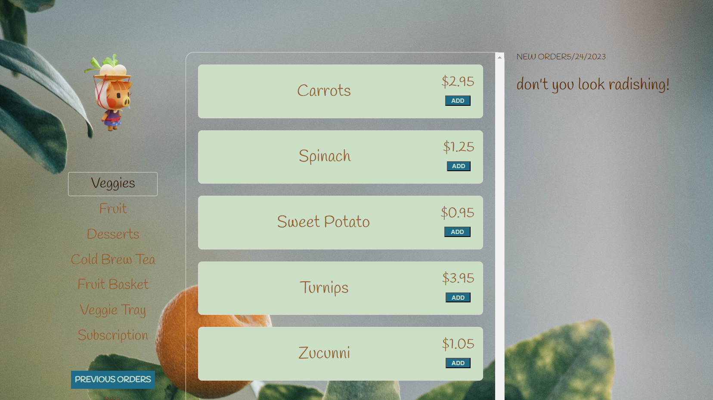

# Produce App 

I wanted to make a produce subscription app, kind of like Imperfect Foods. 

## Home Page

# Unresolved challenges:
- I wanted to add my own icons to the items but couldn't figure out how. I tried for hours and decided to just leave it as is for time sake.
- I also wanted to add a string that would tell you what produce was in season. I added it as a string with a required of true but that didn't seem to work. I'm pretty sure that is the way to do it, I need to go back and work on it.
- 

# Stretch goals
- I want to have the login page fade into the next page.
- I also want to create a dark mode, with the theme remaining similiar but not as bright. 

# Getting Started 

# [Trello Link](https://6442ded12261b4047aaf33b5--dashing-macaron-94372e.netlify.app/](https://trello.com/b/vQgiC6Mb/mod-3-project)

# [Render Link (having issues with this)]()
